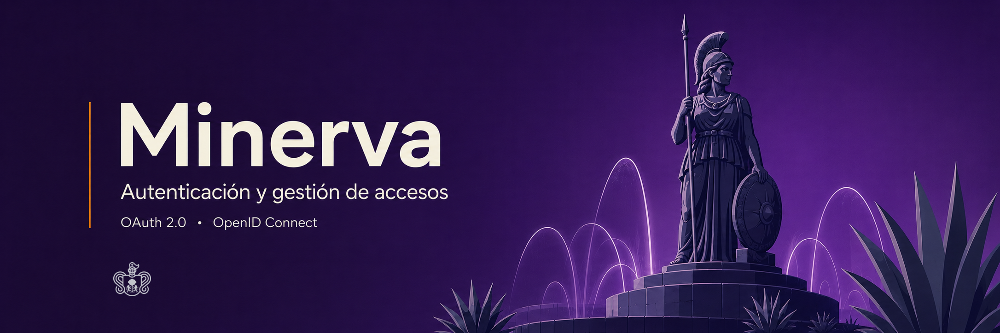

<div align="center">



### El sistema institucional de identidad, autenticación y autorización del IIEG

[](https://github.com/iieg-oficial/minerva/actions/workflows/ci.yml) [](CHANGELOG.md)    

</div>

---

## 🎯 Qué es Minerva

Minerva es el proveedor de identidad del **Instituto de Información Estadística y Geográfica de
Jalisco (IIEG)**. Funciona como un inicio de sesión único (SSO) institucional interno: las plataformas del
instituto redirigen su login hacia Minerva, que autentica al usuario, revisa sus permisos y
devuelve un token firmado — nadie más vuelve a implementar login ni a guardar contraseñas.

## ✨ Qué resuelve

- 🔐 **OIDC / OAuth 2.0 completo** — Authorization Code + PKCE, discovery, JWKS, refresh con rotación y revocación.
- 🔑 **Firma RS256 con rotación de claves** — sin secretos compartidos entre sistemas.
- 🧩 **Permisos declarativos por manifiesto** — `{app}.{recurso}.{acción}`, nunca roles hardcodeados en el consumidor.
- 👥 **Selector de cuentas multi-sesión** — cambia de cuenta sin volver a teclear credenciales.
- 🧰 **SDK oficial para FastAPI** — `get_current_user` / `require_permission`, sin reimplementar validación de JWT.
- 🐳 **Docker-first** — un `docker compose up`, o consume las imágenes ya publicadas en `ghcr.io`.

## ⚖️ Principio rector

> Los sistemas definen *qué* acciones existen. Minerva define *quién* puede hacerlas.
> Los sistemas consumidores validan **permisos**, nunca roles.

Un sistema declara sus permisos (`godin.oficios.create`, `godin.oficios.view`, …) en un
manifiesto declarativo. Minerva administra qué usuarios tienen esos permisos, vía roles y grupos.
El sistema consumidor solo pregunta *"¿este usuario puede hacer X?"* — nunca decide localmente con
`if user.role == "Admin"`. Esa separación es lo que hace que la autorización sea auditable,
consistente entre plataformas y responsabilidad de un solo equipo.

## 💡 Por qué existe

Antes de Minerva, cada sistema del instituto resolvía login y permisos por su cuenta: contraseñas
propias, tablas de roles propias, criterios de "quién puede qué" distintos de un sistema a otro y
sin un lugar único donde auditarlo. Minerva centraliza esa responsabilidad sin acoplar los sistemas
entre sí: cada uno sigue dueño de *qué* funcionalidades expone, Minerva es la única fuente de
verdad de identidad y acceso.

Se distribuye también como **Minerva Dev Kit**: cualquier equipo puede levantar su propia instancia
local para desarrollar contra el mismo contrato OIDC que usará en producción, sin depender de un
servidor compartido — compatible con la futura Minerva Central del instituto.

## 🗂️ Mapa del proyecto

| Carpeta | Qué es |
|---|---|
| [`backend/`](backend) | API FastAPI + SQLModel + PostgreSQL — el proveedor de identidad en sí |
| [`frontend/`](frontend) | Panel administrativo y pantallas de login/autorización (React + Ant Design) |
| [`sdk/`](sdk) | `minerva_sdk`: helpers para que un sistema consumidor valide tokens y permisos sin reimplementar nada |
| [`manifests/`](manifests) | Manifiestos YAML que declaran las aplicaciones, permisos y roles de los sistemas consumidores |
| [`examples/godin-consumer/`](examples/godin-consumer) | Integración de referencia completa con el SDK |
| [`docs/`](docs) | Arquitectura, glosario OIDC, despliegue e integración — ver abajo |

## 🏷️ Versionado

La versión del proyecto es la de [`backend/pyproject.toml`](backend/pyproject.toml), y es la misma
que el tag de release (`vX.Y.Z`) y la etiqueta de las imágenes en ghcr. El backend la reporta en
`GET /` y en `/openapi.json` leyéndola del paquete instalado; el badge de arriba,
`.env.production.example` y `frontend/package.json` la repiten, y
`backend/tests/test_version_alignment.py` falla si alguna se queda atrás.

**`minerva_sdk` versiona por su cuenta** ([`sdk/pyproject.toml`](sdk/pyproject.toml)): lo instalan
sistemas consumidores con su propio ritmo de actualización, así que su número no sigue al del
servidor. La diferencia es deliberada, no un descuido.

## 📚 Guías

Este README es la portada; el detalle técnico vive en `docs/` para no duplicarse ni quedar viejo:

- **[Arquitectura](docs/arquitectura.md)** — cómo está construido Minerva, diagramas de flujo OIDC, capas del backend.
- **[Integración](docs/integracion.md)** — guía paso a paso para conectar un sistema consumidor (manifiesto, PKCE, SDK, troubleshooting).
- **[Despliegue](docs/despliegue.md)** — desarrollo, producción, endurecimiento y mantenimiento (rotación de claves, backups).
- **[Uso por imagen Docker](docs/uso-imagen-docker.md)** — consumir Minerva desde `ghcr.io` sin clonar el repositorio.
- **[Glosario OIDC/OAuth](docs/glosario.md)** — los términos del protocolo, explicados una sola vez.

## 🚀 Arrancar en local

```bash
cp .env.example .env
docker compose up --build
```

Panel en `http://localhost:3100`, API en `http://localhost:9000`. El resto — variables de entorno,
usuario administrador por defecto, checklist de producción — está en
**[`docs/despliegue.md`](docs/despliegue.md)**.

## 📄 Licencia

Proyecto interno del IIEG. Uso institucional.
