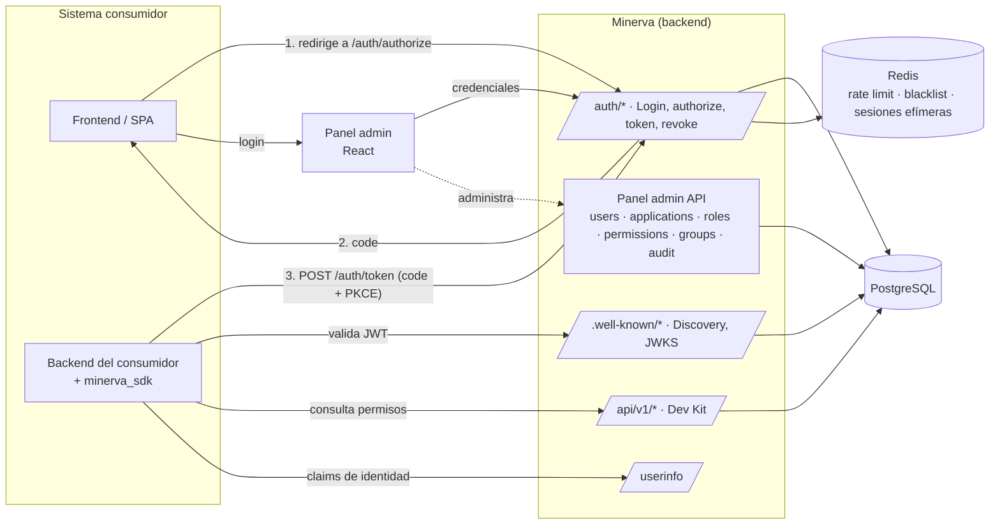
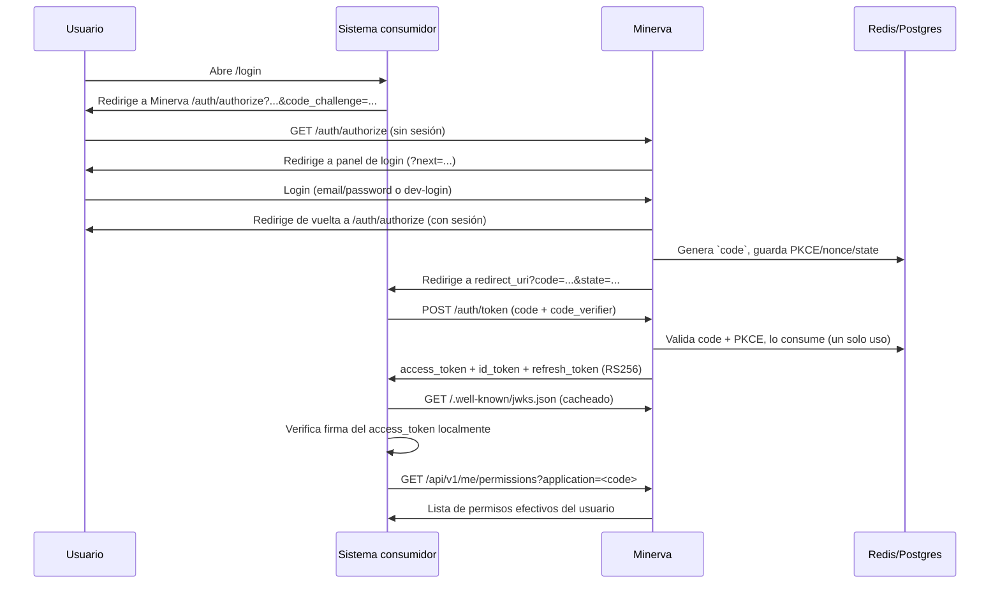
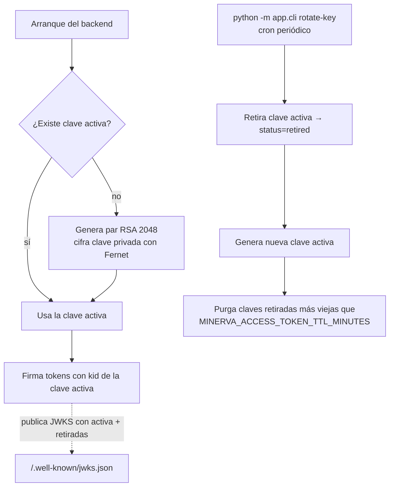

# Arquitectura de Minerva

Minerva es el **proveedor de identidad (IdP) institucional del IIEG**. Centraliza
autenticación, gestión de usuarios/roles/permisos y emisión de tokens **OIDC/OAuth 2.0**
para que las plataformas internas deleguen su login y autorización en un solo lugar.

> Para la terminología OIDC/OAuth usada en este documento, ver [`glosario.md`](glosario.md).
> Para integrar un sistema consumidor, ver [`integracion.md`](integracion.md).
> Para desplegar y operar Minerva, ver [`despliegue.md`](despliegue.md).

## Principio rector

> Los sistemas definen *qué* acciones existen. Minerva define *quién* puede hacerlas.
> Los sistemas consumidores validan **permisos** (`{app}.{recurso}.{accion}`), nunca roles.

Un sistema declara sus permisos en un `manifest.minerva.yml`; Minerva administra qué
usuarios tienen esos permisos (vía roles); el sistema consumidor valida en tiempo de
ejecución con `require_permission("godin.oficios.create")`, nunca con `if user.role == "Admin"`.

## Mapa del monorepo

```
minerva/
├── backend/        FastAPI + SQLModel + Alembic + PostgreSQL — el IdP en sí
├── frontend/        React 19 + Ant Design 6 — panel admin + páginas de login/authorize
├── sdk/            minerva_sdk — helpers para que un consumidor valide tokens y permisos
├── manifests/      YAML que declaran apps/permisos/roles de los sistemas consumidores
├── examples/       godin-consumer — integración de referencia (cliente público + PKCE)
└── docs/           esta documentación
```

## Componentes en tiempo de ejecución



## Backend: arquitectura modular en capas

Cada dominio vive en `backend/app/modules/<nombre>/` con la misma separación estricta:

```
modules/<nombre>/
├── models.py       # Tablas SQLModel — estado en BD, sin lógica de negocio
├── schemas.py      # DTOs Pydantic (Create/Update/Read) — contrato HTTP
├── repository.py   # Único lugar con queries (`select(...)`)
├── service.py       # Lógica de negocio, validaciones, lanza AppException
└── router.py       # APIRouter — fino: parsea, llama al service, responde
```

`router → service → repository → models/schemas`. Ver `backend/CLAUDE.md` para las reglas
completas (no se repiten aquí).

### Módulos

| Módulo | Responsabilidad |
|---|---|
| `auth` | Login/registro, flujo OIDC `/authorize` + `/token` + `/revoke`, rate limiting |
| `oidc` | Claves de firma RS256, JWKS, discovery, `/userinfo` |
| `users` | CRUD de usuarios, hashing de contraseñas |
| `applications` | Registro de aplicaciones consumidoras (`client_id`/secret, redirect URIs, clientes públicos) |
| `roles` | Roles por aplicación |
| `permissions` | Permisos por aplicación y su relación con roles |
| `groups` | Grupos de usuarios; herencia de roles vía grupo |
| `authorization` | Chequeo de permisos efectivos (`/authorization/check`, `/authorization/me/permissions`) |
| `audit` | Bitácora de eventos (login, token exchange, rate limit excedido, etc.) |
| `devkit` | Contrato `/api/v1/*` **solo self-service**: dev-login, `me` y `me/permissions` (consumido por el SDK). La administración (CRUD, import de manifiestos) vive en los routers canónicos del panel |

### `core/`: utilidades compartidas

| Archivo | Responsabilidad |
|---|---|
| `config.py` | `Settings` (Pydantic), variables `MINERVA_*`, validación fail-fast en producción |
| `security.py` | Firma/verificación RS256, PKCE (S256), bcrypt, hashing de tokens |
| `crypto.py` | Cifrado Fernet de la clave privada RSA en reposo |
| `database.py` | Engine y sesión de SQLModel |
| `redis.py` | Cliente Redis async |
| `rate_limit.py` | Ventana deslizante para `/auth/login` y `/auth/authorize` |
| `token_blacklist.py` | Revocación de `jti` (access tokens) |
| `dependencies/auth.py` | `get_current_user` / `get_optional_user` — valida RS256 contra JWKS + blacklist |
| `exceptions.py` | Jerarquía de `AppException` con mensajes en español |

### Por qué `.well-known` y `/userinfo` son sub-apps aparte

`app/main.py` monta `wellknown_app` y `userinfo_app` (definidas en
`app/modules/oidc/router.py`) como **sub-aplicaciones FastAPI independientes**, no como
routers de la app principal:

- Deben responder con `Access-Control-Allow-Origin: *` (cualquier consumidor puede
  descubrir la configuración o validar su token) — incompatible con `allow_credentials=True`,
  que sí usa la app principal (cookies/sesión del panel).
- Aislarlas en su propia sub-app les da una política de CORS propia sin tocar la de la app principal.

## Flujo de autenticación delegada (OIDC Authorization Code + PKCE)



Ver [`integracion.md`](integracion.md) para el detalle paso a paso y
[`glosario.md`](glosario.md) para cada término (`PKCE`, `code_challenge`, `nonce`, etc.).

## Firma de tokens y rotación de claves

Toda la firma es **RS256** (no hay HS256 en el sistema: un solo mecanismo de firma para
tokens de consumidores y de sesión interna del panel).



La clave privada nunca se expone: se cifra con Fernet (`MINERVA_KEY_ENCRYPTION_KEY`) y
se guarda en la tabla `signing_keys`. El JWKS público solo expone la(s) clave(s) pública(s).

## Frontend

`frontend/src/` sigue un patrón **feature-sliced**: un cliente HTTP en `api/<dominio>.js`
(axios) por cada dominio, y páginas/componentes en `features/<feature>/`. Dos áreas:

- **`features/auth/`** — páginas públicas: login, `AuthorizePage` (punto de entrada del
  flujo OIDC para sistemas consumidores), dashboard, logout.
- **`features/admin/`** — panel administrativo (usuarios, aplicaciones, roles, permisos,
  grupos, autorización, auditoría), protegido por `ProtectedRoute`.

## SDK (`sdk/minerva_sdk`)

Helpers de FastAPI para que un sistema consumidor valide identidad y permisos sin
reimplementar la verificación JWT:

- `get_current_user`: decodifica el Bearer, exige `alg=RS256` (rechaza confusión de
  algoritmo), valida contra el JWKS de Minerva (cacheado), opcionalmente verifica `aud`/`iss`.
- `require_permission(permission, application_code=None)`: dependencia que además
  consulta `GET /api/v1/me/permissions` en tiempo real (con caché corta) — un permiso
  revocado en Minerva deja de pasar en el siguiente request, sin esperar a que expire el token.

Ver `examples/godin-consumer/` como integración de referencia completa.

## Manifiestos

Cada sistema consumidor declara su aplicación, permisos y roles en un
`manifest.minerva.yml` (formato y validaciones en [`integracion.md`](integracion.md)).
Minerva los auto-importa al arrancar (`MINERVA_AUTO_IMPORT_MANIFESTS`) de forma
**idempotente** (upsert: reimportar no borra datos ni regenera secrets).

## Estado real de la implementación

Ver el checklist interno (`docs/minerva-roadmap-checklist.md`, no trackeado en git) para
el detalle componente por componente.
