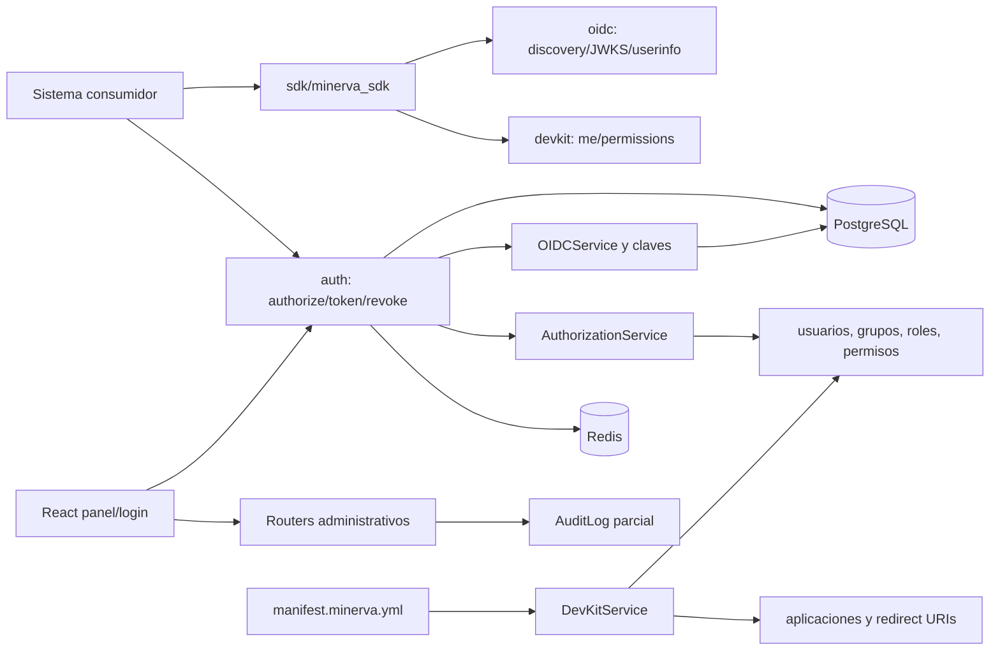

# Auditoría integral de Minerva para la versión 1.0.0

**Corte:** 19 de julio de 2026  
**Revisión:** commit `318538c`, rama `develop`, tag `v0.3.4`  
**Alcance:** implementación OAuth 2.0/OIDC, autorización, SDK, panel, despliegue, documentación y preparación open source.

> Este documento es un diagnóstico y un mapa técnico; no aplica correcciones. El color del semáforo describe el tipo y la sensibilidad del cambio, no su prioridad. Por ejemplo, una licencia es verde por no alterar el runtime, pero bloquea la publicación de una versión open source.

## 1. Veredicto ejecutivo

Minerva ya es un producto funcional y coherente en su idea central: los sistemas consumidores declaran permisos, Minerva asigna identidad y autorización, y los consumidores validan permisos mediante un SDK. La separación FastAPI/React/SDK, el uso de RS256/JWKS, PKCE S256 para clientes públicos, refresh-token rotation y redirect URIs exactas son buenas bases.

No se recomienda publicar el estado actual como `1.0.0`. Hay cuatro fronteras que deben cerrarse primero:

1. **Autorización administrativa:** cualquier usuario autenticado puede usar el CRUD duplicado de `/api/v1`, importar un manifiesto y asignarse un rol. Los tests actuales consagran ese comportamiento.
2. **Separación de tokens:** Minerva acepta access tokens de consumidores como sesiones internas porque la validación central no distingue audiencia ni clase de token; `/auth/refresh` puede convertirlos en sesiones de 8 horas.
3. **Ciclo de vida de sesiones y claves:** la revocación depende de Redis sin persistencia, y la rotación de claves no coordina los cachés ni conserva la clave durante la vida máxima de todos los tokens.
4. **Contrato publicado:** Google Workspace es un stub 501 y existen desviaciones OAuth/OIDC en `response_type`, `state`, `auth_time`, errores estándar y atomicidad de códigos/refresh tokens.

La ruta viable no es convertir Minerva en otro Keycloak. El MVP público debe cerrar seguridad, interoperabilidad, auditoría y operación; MFA propio, SCIM, multitenancy, ABAC y administración avanzada pueden quedar fuera de 1.0.0.

## 2. Método y criterios

Se contrastaron `CLAUDE.md`, los cinco documentos de `docs/`, README, configuración, migraciones, backend, frontend, SDK, ejemplo consumidor, manifiestos, tests y workflows. Se trazaron los flujos de login, autorización, canje, refresh, revocación, administración e importación. La revisión se validó con linters, tipos, builds y pruebas disponibles, y se contrastó con especificaciones y guías primarias listadas en [Referencias](#12-referencias-consultadas).

Se excluyeron deliberadamente mejoras sin un caso de riesgo, interoperabilidad, operación o experiencia comprobable. Cada elemento propuesto tiene una condición de cierre verificable.

## 3. Estado y configuración actual

| Área | Estado observado |
|---|---|
| Repositorio | Monorepo, 199 archivos versionados, aproximadamente 9.3 kLOC de código, 121 commits; rama `develop`, tag `v0.3.4`. |
| Backend | FastAPI + SQLModel + Alembic + PostgreSQL; módulos `applications`, `audit`, `auth`, `authorization`, `devkit`, `groups`, `oidc`, `permissions`, `roles`, `users`. |
| Firma | RS256; clave privada cifrada en PostgreSQL, JWKS con clave activa y retiradas. |
| Tokens | Sesión de panel: 480 min; access token consumidor: 15 min; refresh token: persistente y rotado. |
| Revocación | Familias refresh en PostgreSQL; blacklist de `jti`, invalidación por usuario y rate limiting en Redis. |
| Redis | Sin AOF/RDB, `allkeys-lru`, 256 MB. Puede perder blacklist e invalidaciones. |
| Frontend | React 19 + Ant Design 6 + Vite; varias sesiones bearer guardadas en `localStorage`. |
| SDK | Paquete FastAPI `0.1.0`, validación JWKS/audience y consulta remota de permisos con caché. No se publica como paquete estable. |
| Despliegue | Docker Compose; nginx sirve SPA y proxea OIDC, panel y `/api/v1`. PostgreSQL y Redis también exponen puertos en el compose de desarrollo. |
| Open source | Repositorio remoto privado, sin licencia declarada, `SECURITY.md`, `CONTRIBUTING.md`, código de conducta ni gobierno. |
| Versionado | Desalineado: tag `0.3.4`, badge README `0.3.3`, endpoint raíz `0.1.0`, SDK `0.1.0` y ejemplo productivo `0.2.1`. |

## 4. Base de conocimiento: mapa navegable

Esta sección sirve como índice RAG. Cada nodo indica su fuente de verdad, dependencias y puntos habituales de cambio.

### 4.1 Identidad y sesiones internas

- **Entrada HTTP:** `backend/app/modules/auth/router.py`: registro, login, logout, Google, authorize, token, revoke y refresh de sesión.
- **Reglas:** `backend/app/modules/auth/service.py`: valida cliente/redirect, acceso a app, reautenticación, códigos, tokens y refresh families.
- **Validación común:** `backend/app/core/dependencies/auth.py`: decodifica cualquier JWT contra JWKS, blacklist e invalidación por usuario.
- **Emisión:** `backend/app/modules/oidc/service.py` y `backend/app/core/security.py`.
- **Cliente:** `frontend/src/api/session.js` guarda todas las cuentas y tokens; `frontend/src/api/client.js` agrega Bearer.
- **Cambios sensibles:** audiencias/tipos de token, cookies del panel, TTL, logout, rotación de claves y Redis.

### 4.2 Flujo OAuth 2.0/OIDC de consumidores

1. La app registra `client_id`, tipo público/confidencial y redirect URI exacta.
2. El navegador llega a `/auth/authorize`; Minerva valida app/redirect, sesión, acceso y PKCE.
3. Se crea `AuthCode` en PostgreSQL con scope, PKCE, nonce y un `auth_time`.
4. La app canjea en `/auth/token`; se emiten access token, refresh token e ID token si pidió `openid`.
5. El access token usa como audiencia el slug de la app; el ID token usa `client_id`.
6. El refresh token rota dentro de una familia; reuse intenta revocar toda la familia.
7. `/auth/revoke` revoca refresh family y blacklistea access `jti` asociados.

**Fuentes:** `backend/app/modules/auth/{router,service,repository,models}.py`, `backend/app/modules/oidc/*`, `backend/app/core/security.py`.  
**Consumidores:** `sdk/minerva_sdk`, `examples/godin-consumer`, `docs/integracion.md`.

### 4.3 Modelo de autorización

- `Application` delimita roles, permisos, redirect URIs y audiencia.
- `UserRole` asigna rol directo; `GroupUser` + `GroupRole` lo asignan por grupo.
- `RolePermission` agrega capacidades; el contrato externo debe evaluar permisos, no nombres de rol.
- `AuthorizationService` protege el panel; `DevKitService.get_me_permissions` expone el shape liviano al SDK.
- La administración canónica usa `require_minerva_admin`; el CRUD duplicado de Dev Kit no.

**Cambio seguro:** conservar el contrato `GET /api/v1/me/permissions`.  
**Cambio urgente:** retirar o proteger los endpoints administrativos duplicados bajo `/api/v1`.

### 4.4 Manifiestos

- **Parser/validación:** `backend/app/modules/devkit/manifest.py`.
- **Aplicación:** `DevKitService.import_manifest` crea o actualiza aplicación, permisos, roles y asociaciones.
- **Entrada:** archivo o YAML plano en `/api/v1/manifests/import`; autoimport en desarrollo.
- **Política actual:** aditiva; eliminar algo del YAML no elimina el privilegio persistido.
- **Mejora acotada:** preview/dry-run y modo de reconciliación explícito, nunca borrado implícito.

### 4.5 SDK e integración

- `get_current_user` valida firma, algoritmo y opcionalmente issuer/audience.
- `require_permission` consulta `/api/v1/me/permissions` y cachea por `(sub, application_code)`.
- JWKS se cachea una hora; permisos, cinco minutos.
- El token se inyecta en el diccionario de usuario como `_token` para la consulta posterior.
- El ejemplo Godín demuestra integración, pero no sustituye pruebas de compatibilidad o conformance.

### 4.6 Panel y UX

- `features/auth`: login, selector de cuentas, authorize y branding.
- `features/admin`: dashboard y CRUD de usuarios, aplicaciones, roles, permisos, grupos, autorización y auditoría.
- `api/session.js`: estado multicuenta persistente; su espejo legacy alimenta interceptor y rutas protegidas.
- Riesgo dominante: un XSS obtiene todas las sesiones de 8 horas. La transición recomendada afecta solo al panel, no los bearer tokens de consumidores.

### 4.7 Datos y operación

- PostgreSQL es fuente de verdad de identidad, autorización, códigos, refresh tokens, claves y audit log.
- Redis se usa como control de seguridad, no solo caché: blacklist e invalidaciones. Por ello su pérdida sí cambia decisiones de acceso.
- Alembic administra el esquema; el entrypoint migra antes de iniciar.
- `/health` solo confirma que el proceso responde; no prueba DB, Redis, clave activa ni migraciones.

### 4.8 Dónde aplicar cambios frecuentes

| Solicitud | Archivos iniciales | Verificación mínima |
|---|---|---|
| Nuevo claim/token | `core/security.py`, `auth/service.py`, `oidc/*`, SDK | tests JWT + OIDC conformance |
| Regla de acceso | `authorization/service.py`, relaciones groups/roles/permissions | tests directo, grupo y aislamiento entre apps |
| Nuevo endpoint admin | router/service/repository del módulo + `AuditService` | admin/no-admin + audit event |
| Cambio de manifiesto | `devkit/manifest.py`, `devkit/service.py`, docs integración | idempotencia, preview y stale privilege |
| Sesión del panel | auth router/service, frontend auth/session, nginx | XSS/session fixation/logout/CSRF |
| Rotación de claves | `oidc/service.py`, CLI, caché backend, SDK | old/new token durante ventana máxima |
| Despliegue | compose, nginx, `.env*.example`, docs despliegue/imagen | compose config, TLS headers, readiness |

## 5. Hallazgos rojos: bugs, seguridad o cambios sensibles

| ID | Hallazgo y evidencia | Impacto real | Cierre verificable |
|---|---|---|---|
| R1 | `/api/v1` expone CRUD de apps, usuarios, roles, permisos, asignaciones y manifests con solo `get_current_user` (`devkit/router.py:82-293`). El test crea un usuario sin privilegios, importa una app y se asigna Administrador (`tests/test_devkit.py:100-124`). | Escalación completa de privilegios por cualquier usuario autenticado. | En central solo quedan endpoints self-service; administración exige `require_minerva_admin`. Test negativo 403 para no-admin. |
| R2 | `_resolve_token` decodifica sin audience ni clase (`dependencies/auth.py:35-48`) y `/auth/refresh` reemite sesión desde cualquier token aceptado (`auth/router.py:354-360`). | Confusión entre access token consumidor y sesión de panel; posible extensión a 8 h y acceso admin por sujeto. | Tipos de token mutuamente excluyentes (`typ`/claims), issuer+audience obligatorios por endpoint y tests de rechazo cruzado. |
| R3 | La rotación firma inmediatamente con la nueva clave, pero no invalida caché backend (5 min) ni fuerza refresh del SDK (1 h). Además purga retiradas a los 15 min aunque hay sesiones de 480 min (`oidc/service.py:96-113`). | Corte de servicio al rotar; tokens de panel aún vigentes pueden quedar inválidos. | Publicar nueva clave antes de firmar, refresh por `kid` desconocido, invalidar cachés y conservar overlap por vida máxima + skew. |
| R4 | Registro público `/auth/register` crea usuario activo y sesión; email/password son strings sin normalización, verificación ni política institucional. | Cuentas no verificadas y superficie de abuso en un IdP institucional. | Registro cerrado por defecto/configurable, invitación o federación; email normalizado/verificado y política de contraseña si se mantiene login local. |
| R5 | Google callback siempre responde 501 (`auth/router.py:154-159`); `authlib` está instalado pero no usado. | El login institucional anunciado no existe. | Code flow completo, validación issuer/aud/nonce/hd, vinculación segura y pruebas negativas; o retirar la promesa de 1.0. |
| R6 | `response_type` se recibe pero se ignora; `code`, `state` y errores se concatenan sin encoding ni preservación de query (`auth/service.py:211`, `auth/router.py:197-218`). | Interoperabilidad rota; `state` puede alterarse y una redirect URI con query se construye mal. | Builder URL estándar, state byte-for-byte, rechazo `unsupported_response_type` y matriz de callbacks. |
| R7 | `auth_time` se fija al crear el código (`auth/service.py:200`) y no a la autenticación real. | `max_age` e ID token informan una frescura falsa. | Propagar tiempo real de autenticación de la sesión y probar reuso SSO/max_age. |
| R8 | Código y refresh se leen activos y luego se marcan usados/rotados en commits separados, sin operación condicional o lock. | Canjes concurrentes pueden emitir más de una familia/token. | Update atómico `WHERE status=active` o bloqueo de fila; prueba concurrente de un solo ganador. |
| R9 | Canje no revalida `app.status` ni `user.status`; refresh revalida usuario pero no app (`auth/service.py:213-274,343-380`). | Una desactivación entre authorize y token, o durante refresh, no se respeta. | Revalidar ambos sujetos en cada grant; pruebas deactivate-between-steps. |
| R10 | `add_permission_to_role` no comprueba que rol y permiso pertenezcan a la misma aplicación (`permissions/service.py:53-66`). | Relaciones inválidas y posible contaminación de límites de aplicación. | Validación de dominio + restricción/invariante en datos + migración que detecte relaciones existentes. |
| R11 | Redis no persiste y usa `allkeys-lru` aunque guarda blacklist e invalidaciones (`docker-compose.yml:47-55`). | Un reinicio/evicción puede resucitar tokens revocados hasta 8 h. | Store durable o sesiones de panel server-side; prueba de reinicio y política explícita de fail-safe. |
| R12 | SDK cachea permisos por usuario/app, no por token/jti (`sdk/minerva_sdk/fastapi.py:87-113`), y no refresca JWKS al ver `kid` desconocido. | Token revocado conserva autorización cacheada hasta 300 s; rotación causa 401 hasta 1 h. | Caché ligada a jti/exp con invalidación, refresh JWKS once-on-unknown-kid y pruebas. |
| R13 | SDK añade el bearer crudo al objeto de usuario (`fastapi.py:78-84`). | Una respuesta/log accidental del diccionario filtra credenciales. | Contexto interno separado del payload público. |
| R14 | El panel guarda múltiples bearer tokens de 8 h en `localStorage`; nginx carece de CSP y headers defensivos (`session.js:27-54`, `nginx.conf`). | Un XSS exfiltra todas las cuentas persistidas. | Sesión del panel en cookie HttpOnly/Secure/SameSite o BFF, CSRF explícito, CSP/HSTS/nosniff/referrer policy. |
| R15 | Eliminación manual de aplicación no cubre códigos, refresh tokens ni audit logs vinculados; solo llama al repositorio (`applications/service.py:61-67`). | Una app utilizada puede fallar al eliminarse por FK o dejar datos incoherentes. | Política de soft-delete/retención o cascade transaccional probado con app usada. |
| R16 | Redirect URIs: backend devuelve lista, frontend espera `data.items` (`ApplicationsPage.jsx:155-172`). Menú encuentra primero `/admin` para cualquier subruta (`AdminLayout.jsx:47`). | La UI oculta URIs existentes y marca siempre Dashboard. | Contract test de API/cliente y selección por coincidencia exacta/más larga. |
| R17 | El seed retorna si ya existe el admin y no repara app/rol/permisos/asignación faltantes. | Inicialización parcial queda permanentemente inconsistente. | Seed idempotente por recurso, con prueba de estados parciales. |
| R18 | Update de usuario duplicado en Dev Kit evita la invalidación que sí ejecuta el router canónico. | Cambiar estado/credenciales por esa ruta deja sesiones vigentes. | Eliminar duplicado o centralizar invalidación en servicio transaccional. |

## 6. Hallazgos amarillos: mejora real y aditiva

| ID | Mejora | Razón y condición de cierre |
|---|---|---|
| Y1 | Errores OAuth/OIDC estándar | `/token`, `/revoke` y authorize deben devolver `invalid_request`, `invalid_client`, `invalid_grant`, etc., con status/header correctos. Pruebas con clientes estándar. |
| Y2 | Conformance suite OIDC | Ejecutar OpenID Foundation Conformance Suite sobre un entorno reproducible y convertir el perfil escogido en gate de RC. |
| Y3 | Reconciliación de manifests | Añadir preview/diff y modo `--reconcile` explícito para detectar permisos/roles/redirects obsoletos; no borrar por default. |
| Y4 | Auditoría completa | Registrar actor, objetivo, before/after y resultado de CRUD, asignaciones, manifests, secretos y claves; incluir fallos relevantes de token. |
| Y5 | Gestión visible de grupos | Listar miembros/roles efectivos y permitir removerlos; hoy se pueden agregar relaciones sin administrar completamente su estado. |
| Y6 | Readiness y observabilidad | Separar liveness/readiness; verificar DB, Redis, migración y clave; métricas de login/grants/fallos/rate-limit/rotación con alertas. |
| Y7 | Operación segura | Backups/restores ensayados, rotación programada, TLS, reverse proxy confiable, runbooks y rollback. No confiar en `FORWARDED_ALLOW_IPS=*` fuera de red cerrada. |
| Y8 | Validación de dominio en DB/API | Unique constraints por app para slugs/URIs, enums/status, URI sin fragmento y HTTPS salvo loopback; evita carreras que la validación Python no cubre. |
| Y9 | Logout interoperable | Publicar revocation endpoint en metadata y evaluar RP-Initiated Logout para consumidores que lo necesiten, sin mezclarlo con logout del panel. |
| Y10 | Seguridad de página authorize | No cargar recursos de terceros; alojar/proxy seguro de logos y `Referrer-Policy: no-referrer`. |
| Y11 | Rendimiento frontend acotado | El bundle principal supera 1.3 MB; dividir rutas admin/auth y medir, sin reescribir UI. |
| Y12 | Matriz de compatibilidad SDK | Versionar SDK junto al protocolo, publicar changelog, soportes Python/FastAPI y tests contra al menos la versión mínima/máxima declarada. |

**Fuera de 1.0.0 salvo requisito institucional:** MFA propio, passkeys, SCIM, multitenancy, ABAC, flujos device/client-credentials, social login adicional y marketplace de extensiones. Google como upstream puede aportar MFA sin duplicarlo dentro de Minerva.

## 7. Hallazgos verdes: publicación, claridad y simplificación

| ID | Ajuste | Resultado esperado |
|---|---|---|
| G1 | Elegir licencia OSI con jurídico IIEG | `LICENSE` y headers/política claros. Apache-2.0 favorece adopción; AGPL preserva apertura de despliegues modificados. La decisión es institucional. |
| G2 | Política de seguridad | `SECURITY.md` con canal privado, versiones soportadas, SLA inicial y proceso de divulgación. |
| G3 | Comunidad y gobierno | `CONTRIBUTING.md`, código de conducta, maintainers/CODEOWNERS, soporte, DCO/CLA si aplica y proceso de releases. |
| G4 | Corregir narrativa/versiones | Eliminar “completo” hasta conformance; sincronizar tag, API, README, SDK, ejemplos y envs desde una sola fuente. |
| G5 | Seguridad de supply chain | Dependabot/Renovate, CodeQL, dependency review, secret scanning, SBOM/provenance; fijar Actions por SHA e imágenes por digest donde aporte reproducibilidad. |
| G6 | Imágenes mínimas no-root | `npm ci`, lockfiles estrictos, usuarios no-root y healthchecks reales. |
| G7 | Eliminar duplicación Dev Kit | Retener `/me`/`me/permissions`; reutilizar routers/servicios canónicos para administración. |
| G8 | Unificar cálculo de autorización | Una sola función para roles directos+grupos+permisos, hoy repetida en AuthService, AuthorizationService y DevKitService. |
| G9 | Retirar código/dependencias muertas | Corregir/eliminar `delete_redirect_uri` roto; revisar `jinja2`, `orjson`, `python-dotenv` y settings JWT legacy. Mantener `authlib` solo si se completa Google. |
| G10 | Higiene documental | Añadir mapa de conocimiento, ADRs para tokens/revocación/licencia y tabla “afirmación → prueba”. |

### Auditoría de complejidad (Ponytail)

- `devkit/router.py:82-293`: cortar CRUD duplicado; usar API administrativa canónica.
- `auth/service.py`, `authorization/service.py`, `devkit/service.py`: reemplazar tres recorridos de roles/permisos por una consulta/servicio único.
- Routers admin: quitar `get_current_user` redundante donde el router ya exige `require_minerva_admin`.
- `applications/service.py:138-139`: eliminar o reparar método muerto con firma incompatible con repositorio.
- Dependencias y settings legacy: borrar solo después de `rg` + prueba de despliegue; no crear una capa de compatibilidad nueva antes de 1.0.

## 8. Documentación declarada vs. implementación

| Declaración | Realidad | Acción |
|---|---|---|
| “OIDC/OAuth 2.0 completo” | Hay code+PKCE/JWKS/refresh, pero no conformance, `response_type` se ignora y errores/state/auth_time divergen. | Cambiar a “perfil implementado” hasta aprobar suite. |
| Google Workspace | `/google/callback` es TODO 501. | Completar o sacar del alcance público. |
| Logout “invalida de verdad” | Blacklist es Redis volátil y logout normal conserva token en localStorage. | Explicar dos modalidades y hacer durable la garantía. |
| Revocación visible al siguiente request SDK | Caché de permisos puede evitar tocar Minerva 300 s. | Documentar ventana y corregir key/invalidation. |
| Separación modular estricta | Seed y DevKit hacen consultas/lógica transversal; endpoints duplican capas. | Simplificar fronteras, no añadir abstracciones. |
| Versión actual | Cinco valores distintos entre tag, README, API, SDK y env. | Fuente única y release check. |
| Redis “solo relaja rate limit” al perderse | También pierde decisiones de revocación e invalidación. | Corregir documentación y arquitectura. |

## 9. Roadmap recomendado hacia 1.0.0

### Fase 0 — Congelar contrato y preparar pruebas (1 sprint)

- Definir perfiles soportados: Authorization Code, confidential/public, PKCE S256, OIDC scopes, revocation y panel interno.
- Threat model corto: actores, tokens, fronteras panel/consumidor/DevKit, Redis y claves.
- Crear tests negativos actuales para R1 y R2 antes de cambiar código.
- Definir migraciones compatibles y guía para consumidores existentes.

**Gate:** contrato y riesgos aprobados por equipo; suite reproduce las vulnerabilidades críticas.

### Fase 1 — Cerrar control de acceso y grants (1–2 sprints)

- R1, R2, R4, R8, R9, R10, R18.
- Separar token de sesión de access/ID/dev; audience/issuer/tipo por endpoint.
- Hacer atómico code/refresh y revalidar app/usuario.

**Gate:** ningún no-admin muta IAM; ningún tipo de token cruza contexto; pruebas concurrentes pasan.

### Fase 2 — Sesión, revocación, claves y SDK (1–2 sprints)

- R3, R11–R14; migrar solo sesión del panel a cookie/BFF.
- Diseñar rotación publish-before-use y overlap máximo.
- Versión candidata del SDK con caché por jti y refresh por kid.

**Gate:** reinicios/rotaciones no resucitan ni cortan sesiones fuera de política; SDK anterior tiene migración documentada.

### Fase 3 — Interoperabilidad OIDC (1 sprint)

- R5–R7, Y1, Y2, Y9, Y10.
- Completar Google o removerlo del alcance; URL/error/auth_time estándar.
- Ejecutar conformance suite sobre HTTPS reproducible.

**Gate:** perfil de conformance aprobado, sin excepciones críticas abiertas.

### Fase 4 — Producto y operación (1 sprint)

- R15–R17, Y3–Y8, Y11–Y12.
- Auditoría de todas las mutaciones, readiness, backups y restore drill.
- Corregir UX funcional y reconciliación segura de manifests.

**Gate:** smoke/restore/runbook ejecutados; administrador puede observar y revertir operación según política.

### Fase 5 — Release candidate open source (1 sprint)

- G1–G10; revisión jurídica y de secretos de todo el historial.
- CI reproducible, SBOM/provenance, release notes, upgrade guide y soporte declarado.
- Publicar `1.0.0-rc.1`, integrar al menos un consumidor real y congelar API/SDK.

**Gate 1.0.0:** cero rojos abiertos, licencia y SECURITY presentes, conformance aprobado, restore y key rotation ensayados, documentación/versiones consistentes y dos integraciones verificadas (ejemplo + sistema real).

## 10. Validación ejecutada

| Comando/área | Resultado |
|---|---|
| Backend Ruff lint | Correcto. |
| Backend Ruff format check | Correcto, 94 archivos formateados. |
| Backend mypy | **Falló:** 43 errores en 13 archivos; incluye firma rota en `delete_redirect_uri`, nullability y tipos de repositorios/requests. Debe ser gate antes de 1.0. **Revisión 20/07/2026 (commit `33c85f4`):** 52 errores en 15 archivos; mypy no está en `ci.yml`, por eso el conteo crece sin vigilancia. Seguimiento en #53; la firma rota de `delete_redirect_uri` se atiende en #45. |
| Backend pytest completo | ~~**No concluyó:** dos ejecuciones quedaron sin salida durante varios minutos y se interrumpieron.~~ **Corregido el 20/07/2026 (commit `33c85f4`): no se reproduce.** `pytest tests/` sobre el env conda `minerva` termina en 54 s con 138 pruebas en verde. El hang original probablemente vino de correr `pytest` sin el argumento `tests/` (colecta `alembic/`) o fuera del entorno. No hay tarea de release derivada de este punto. |
| Frontend ESLint | Correcto con una advertencia: `pagination` sin usar en GroupsPage. |
| Frontend build | Correcto; advertencia de chunk principal >500 kB (1,303.10 kB, 418.03 kB gzip). |
| Self-check de sesiones | Correcto. |
| SDK pytest | 3 pruebas correctas. |
| Docker Compose config | Correcto con entorno temporal. |
| Secretos versionados | Búsqueda textual no encontró una clave real obvia; no sustituye escaneo de historial con secret scanning. |

## 11. Orden sugerido para la valoración del equipo

1. **Bloquear exposición:** R1 y dev-login/import en central.
2. **Aprobar arquitectura de token/sesión:** R2, R11, R14; esta decisión condiciona SDK y frontend.
3. **Reparar grants y aislamiento:** R8–R10, R15, R18.
4. **Hacer rotación/revocación operables:** R3, R12.
5. **Cerrar estándar y Google:** R5–R7, Y1–Y2.
6. **Preparar release público:** G1–G6 y gates de Fase 5.

No conviene empezar por rediseñar pantallas o añadir MFA propio. Primero se debe demostrar que el límite administrativo, el tipo de token y la revocación son correctos.

## 12. Referencias consultadas

### Estándares y seguridad OAuth/OIDC

- [RFC 6749 — OAuth 2.0 Authorization Framework](https://www.rfc-editor.org/rfc/rfc6749.html): response type, state, redirect y errores.
- [RFC 7009 — Token Revocation](https://www.rfc-editor.org/rfc/rfc7009.html): contrato y expectativas de revocación.
- [RFC 8725 — JSON Web Token Best Current Practices](https://www.rfc-editor.org/rfc/rfc8725.html): issuer/audience y reglas mutuamente excluyentes por tipo de JWT.
- [RFC 9700 — OAuth 2.0 Security Best Current Practice](https://www.rfc-editor.org/rfc/rfc9700.html): PKCE S256, redirect exacta, TLS, authorization pages y mix-up.
- [OpenID Connect Core 1.0](https://openid.net/specs/openid-connect-core-1_0-18.html): nonce, prompt, max_age y auth_time.
- [OpenID Foundation Conformance Suite](https://openid.net/certification/about-conformance-suite/): suite abierta para probar implementaciones; [política para proyectos open source](https://openid.net/certification/open-source-project-certification-policy/).

### Comparación funcional

- [Keycloak Server Administration Guide](https://www.keycloak.org/docs/latest/server_admin/): sesiones, políticas de contraseña, MFA/WebAuthn, identity brokering, grupos y roles.
- [ZITADEL Features](https://zitadel.com/docs/concepts/features), [Audit Trail](https://zitadel.com/docs/concepts/features/audit-trail) y [Self-Service](https://zitadel.com/docs/concepts/features/selfservice): referencia para auditoría, autenticación fuerte y autoservicio, no backlog obligatorio.

### Aplicación web y publicación

- [OWASP HTML5 Security Cheat Sheet](https://cheatsheetseries.owasp.org/cheatsheets/HTML5_Security_Cheat_Sheet.html) y [Session Management](https://cheatsheetseries.owasp.org/cheatsheets/Session_Management_Cheat_Sheet.html): almacenamiento de tokens, cookies y sesiones.
- [OWASP HTTP Headers Cheat Sheet](https://cheatsheetseries.owasp.org/cheatsheets/HTTP_Headers_Cheat_Sheet.html): CSP, HSTS, nosniff y Referrer-Policy.
- [Open Source Initiative — Approved Licenses](https://opensource.org/licenses): criterio de licencia open source.
- [GitHub Security Features](https://docs.github.com/en/code-security/getting-started/github-security-features), [Dependency Review](https://docs.github.com/en/code-security/concepts/supply-chain-security/dependency-review) y [Secret Scanning](https://docs.github.com/en/code-security/concepts/secret-security/secret-scanning): controles para repositorio público.

## 13. Criterio de cierre de la auditoría

La auditoría deja de generar mejoras cuando se cumplen los gates definidos y cada afirmación pública tiene una prueba reproducible. Las ideas fuera del perfil 1.0.0 se archivan sin ejecución. Así se evita un ciclo infinito y se preserva un objetivo concreto: una implementación pequeña, interoperable, operable y publicable con confianza.
