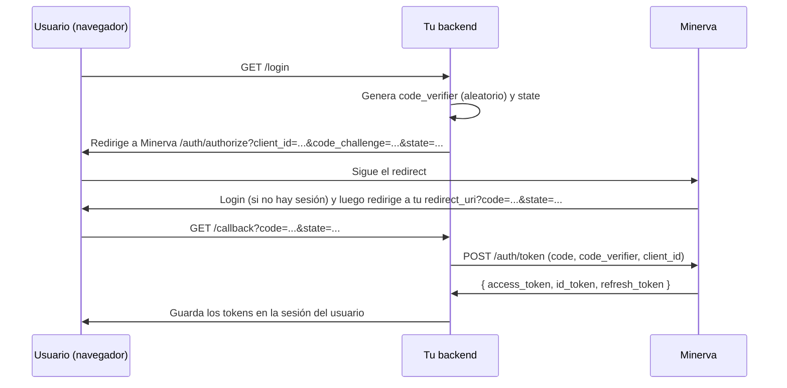

# Guía de integración: cómo conectar tu sistema a Minerva

Esta guía es para equipos que quieren delegar login y autorización a Minerva. Si algún
término no es familiar, revisa primero [`glosario.md`](glosario.md).

## Inicio rápido recomendado

El camino normal usa **una sola URL de Minerva** y cinco valores explícitos:

```env
MINERVA_ISSUER_URL=http://localhost:3100
MINERVA_APPLICATION_CODE=portal_demo
MINERVA_CLIENT_ID=<client_id mostrado por Minerva>
MINERVA_CLIENT_SECRET=<vacío solo para clientes públicos>
MINERVA_REDIRECT_URI=http://localhost:8100/callback
```

1. Importa tu `manifest.minerva.yml` desde **Aplicaciones → Importar manifiesto** en el
   panel de Minerva.
2. Copia el `client_id` y, si es confidencial, el `client_secret` que muestra Minerva.
3. Instala el SDK desde el repositorio (ver [§4](#4-validar-tokens-y-permisos-con-el-sdk-minerva_sdk);
   no está en PyPI) y usa `MinervaOIDC` para login/callback; no armes PKCE ni URLs a mano.
4. Protege APIs con `get_current_user` o `require_permission`.

El ejemplo ejecutable [`examples/minerva-consumer`](../examples/minerva-consumer) muestra el
recorrido completo, incluidos login, logout, roles informativos, permisos y errores 401/403.

## Resumen del contrato

1. Registras tu aplicación en Minerva (`client_id`, redirect URI, cliente público o
   confidencial).
2. Declaras tus permisos y roles en un `manifest.minerva.yml`.
3. Tu frontend redirige el login a Minerva (`/auth/authorize`).
4. Tu backend canjea el código por tokens (`/auth/token`) y valida cada request con el
   SDK (`minerva_sdk`), que verifica la firma RS256 contra el JWKS de Minerva y consulta
   permisos en tiempo real — **nunca validas roles localmente**.

> **Requisito de acceso (importante):** el usuario debe tener **al menos un rol asignado
> en tu aplicación** para que Minerva emita el código de autorización. Si no lo tiene,
> Minerva **no** manda `code`: redirige a `redirect_uri?error=access_denied&state=...`.
> Tu `/callback` debe manejar ese caso (ver [§3.6](#36-acceso-denegado-usuario-sin-rol-en-tu-aplicación)).

## 1. Registrar tu aplicación

### Opción A: importar un manifiesto desde el panel (recomendada)

Entra a **Aplicaciones → Importar manifiesto** y sube tu `manifest.minerva.yml`. Si el
`application.code` es nuevo, Minerva crea la aplicación, registra sus redirect URIs y
muestra el `client_id` y, para un cliente confidencial, el `client_secret` una sola vez.

Usa cliente confidencial cuando tu backend pueda guardar un secreto. Usa cliente público
solo para SPA/móvil sin backend seguro:

- `is_public: true` → cliente público (SPA/móvil sin backend que pueda guardar un
  secreto): la respuesta no incluye `client_secret_hash` y el canje de token exige PKCE.
- `is_public: false` (default) → cliente confidencial: Minerva genera y devuelve un
  `client_secret` (guárdalo de inmediato, no se vuelve a mostrar).

Minerva rechaza cualquier `redirect_uri` en `/auth/authorize` que no coincida
exactamente con una registrada (evita *open redirect*). Registra una entrada por
entorno (`development`, `production`).

### Opción B: alta manual desde el panel

Úsala si todavía no tienes manifiesto. Crea la aplicación y registra cada redirect URI
exactamente como aparecerá en `MINERVA_REDIRECT_URI`; después importa el manifiesto para
dar de alta permisos y roles. Las rutas `/applications` pertenecen al BFF del panel y se
autentican con su cookie de sesión, no con un Bearer de consumidor.

## 2. Declarar permisos y roles (`manifest.minerva.yml`)

Convención de permisos: **`{application_code}.{resource}.{action}`**, con `action` una
de `view, create, update, delete, assign, approve, authorize, export, import, manage`.

```yaml
application:
  code: portal_demo                    # slug único, minúsculas/números/guion_bajo
  name: Portal Demo
  description: Sistema documental de ejemplo
  base_url: http://localhost:8000
  redirect_uris:
    - http://localhost:8000/auth/callback

permissions:
  - key: portal_demo.documents.view
    name: Ver documentos
    description: Permite consultar documentos
  - key: portal_demo.documents.create
    name: Crear documentos

roles:
  - name: Consulta
    description: Solo lectura
    permissions:
      - portal_demo.documents.view
  - name: Capturista
    permissions:
      - portal_demo.documents.view
      - portal_demo.documents.create
```

Validaciones que aplica Minerva al importar (`backend/app/modules/devkit/manifest.py`):
- `application.code` obligatorio, formato `^[a-z0-9_]+$`.
- Cada `permissions[].key` debe matchear `^[a-z0-9_]+\.[a-z0-9_]+\.[a-z0-9_]+$` **y**
  empezar con `{application.code}.` — no puedes declarar permisos de otra aplicación.
- Cada permiso listado en `roles[].permissions` debe existir en `permissions` del mismo
  manifiesto.

**Idempotencia:** reimportar el mismo manifiesto (o una versión actualizada) hace
*upsert* — actualiza nombres/descripciones, agrega permisos/roles nuevos, nunca borra ni
regenera secrets de una aplicación ya existente.

**El contrato es aditivo, no declarativo.** El manifiesto no describe el estado deseado:
**quitar** un permiso o un rol del YAML y reimportar **no lo elimina** de Minerva ni revoca
las asignaciones existentes, y sacar un permiso de la lista de un rol tampoco deshace esa
relación. Renombrar tampoco: la identidad de un permiso es su `key` y la de un rol el slug
de su `name`, así que un rename crea uno nuevo y deja el anterior. Dar de baja algo es una
acción explícita en el panel administrativo.

### Cómo importarlo

**Automático al arrancar Minerva (dev):** coloca el archivo en `manifests/` con alguno
de estos nombres/patrones: `*.minerva.yml`, `*.minerva.yaml`, `manifest.yml`,
`manifest.yaml`. Si `MINERVA_AUTO_IMPORT_MANIFESTS=true` (default en dev), se importa en
cada arranque del backend, como paso único previo al servidor
(`python -m app.cli import-manifests`). Un manifiesto inválido aborta el arranque.

**Manual:** súbelo en **Aplicaciones → Importar manifiesto**. El endpoint interno
`/applications/import-manifest` pertenece al BFF del panel y requiere su cookie de sesión;
no lo automatices con un supuesto `admin_token`. Para despliegues controlados usa el CLI
`python -m app.cli import-manifests` con el manifiesto montado en `MINERVA_MANIFESTS_PATH`.

## 3. Flujo OIDC: Authorization Code + PKCE



### 3.1 Iniciar el login (tu frontend → Minerva)

```
GET {MINERVA_ISSUER}/auth/authorize
    ?client_id={tu client_id}
    &redirect_uri={tu redirect_uri registrada}
    &response_type=code
    &scope=openid profile email
    &state={valor aleatorio, verificas que vuelva igual}
    &code_challenge={BASE64URL(SHA256(code_verifier))}   # obligatorio si cliente público
    &code_challenge_method=S256
    &nonce={opcional, anti-replay del id_token}
```

Parámetros adicionales soportados (OIDC Core 3.1.2.1):
- `prompt=none` → si no hay sesión, Minerva responde `error=login_required` en lugar de
  mostrar login. Sirve para **comprobar la sesión sin interrumpir al usuario**, pero mándalo
  como una navegación normal: Minerva emite `Content-Security-Policy: frame-ancestors 'none'`
  (ver `frontend/nginx.conf`), así que **el *silent renew* clásico en un `<iframe>` oculto no
  funciona** — el navegador bloquea el marco.
- `prompt=login` → fuerza re-autenticación aunque haya sesión (pide credenciales de nuevo).
- `prompt=select_account` → muestra un **selector de cuentas** con las sesiones ya iniciadas en
  ese navegador, permite elegir otra o **agregar una cuenta nueva**. Úsalo cuando tu plataforma
  cierre sesión y quieras que el usuario pueda entrar con una cuenta distinta (sin él, Minerva
  hace SSO silencioso con la última cuenta activa).
- `max_age={segundos}` → fuerza re-autenticación si la sesión es más vieja que ese valor.

Sobre la respuesta de `/authorize`:

- **`response_type` solo acepta `code`** (es lo que declara el discovery). Cualquier otro valor
  (`token`, `id_token`, ...) se rechaza con `error=unsupported_response_type` de vuelta a tu
  `redirect_uri`, no con un `code` como si nada.
- **Tu `state` vuelve byte-for-byte**, aunque contenga espacios, `&`, `=` o `#`. Compáralo tal cual
  con el que generaste: es tu defensa anti-CSRF.
- **Tu `redirect_uri` puede traer query propia** (`https://tu-app/callback?tenant=jal`): Minerva la
  preserva y agrega `code`/`state` a esa misma query. Regístrala completa, tal cual. Si registras un
  `code`, `state` o `error` fijo en esa query, Minerva lo **reemplaza** por el suyo en vez de
  duplicar la clave.
- **`auth_time` del `id_token` es el momento en que el usuario se autenticó en *esa sesión***, no el
  de la emisión del código: un SSO silencioso 6 h después sigue reportando ese login de hace 6 h.
  Es por sesión de navegador, así que si el usuario inicia sesión en otro equipo, esta sesión no
  "rejuvenece"; y refrescar el token del panel no cuenta como re-autenticación. Es la misma
  referencia con la que Minerva evalúa `max_age`, así que lo que exige y lo que reporta coinciden.

> **Logout de Minerva: no es un endpoint para consumidores.** `POST /auth/logout` pertenece al
> panel, no a tu integración: se autentica con la **cookie de sesión del panel** (`__Host-minerva_sid`),
> no con un Bearer, y cierra la cuenta activa del navegador revocando **su token de sesión del panel**
> (la cuenta sigue en el selector, pero volver a ella pide contraseña). **No** toca los tokens OIDC
> que ya emitió a los consumidores. Mandarle tu `access_token` en el header no hace nada.
>
> Si lo que quieres es invalidar credenciales ya emitidas, usa
> [`POST /auth/revoke`](#35-revocar-un-refresh-token-rfc-7009) sobre el refresh token: eso sí revoca
> la familia completa y blacklistea los access tokens asociados. Del lado del panel, la revocación
> real vive en `DELETE /auth/session/accounts/{sub}` (quitar una cuenta del dispositivo) y
> `POST /auth/logout-all` (cerrar todas las sesiones), que son acciones de la UI de Minerva.
>
> **Logout redirigido (`GET {panel}/logout?redirect_uri=...`).** Es la página del panel que llama a
> ese mismo `POST /auth/logout` (revoca la sesión del panel, no tus tokens OIDC) y luego navega al
> destino. `redirect_uri` acepta **solo rutas internas del panel** (`/login`, `/admin/users`…):
> cualquier URL externa —absoluta, protocol-relative o con caracteres de escape— se descarta y el
> usuario termina en `/login`. Los destinos externos exigen registro previo de
> `post_logout_redirect_uris` ([RP-Initiated Logout §2](https://openid.net/specs/openid-connect-rpinitiated-1_0.html#RPLogout)),
> que Minerva aún no implementa. Si tu app necesita volver a sí misma, cierra primero tu sesión y
> redirige al panel al final. Además, si el logout falla, la página **no** redirige: muestra el error
> y ofrece reintentar, para no aparentar un cierre de sesión que no ocurrió.

### 3.2 Canjear el código (tu backend → Minerva, servidor-a-servidor)

```bash
curl -X POST {MINERVA_ISSUER}/auth/token \
  -H "Content-Type: application/x-www-form-urlencoded" \
  -d "grant_type=authorization_code" \
  -d "client_id={tu client_id}" \
  -d "code={code recibido}" \
  -d "redirect_uri={misma redirect_uri}" \
  -d "code_verifier={el verifier original}" \
  -d "client_secret={solo si tu cliente es confidencial}"
```

Respuesta:

```json
{
  "access_token": "eyJhbGciOiJSUzI1NiIs...",
  "id_token": "eyJhbGciOiJSUzI1NiIs...",
  "refresh_token": "...",
  "token_type": "bearer",
  "expires_in": 900
}
```

### 3.3 Refrescar el access token

```bash
curl -X POST {MINERVA_ISSUER}/auth/token \
  -d "grant_type=refresh_token" \
  -d "client_id={tu client_id}" \
  -d "refresh_token={el refresh_token actual}"
```

El refresh token devuelto en la respuesta **reemplaza** al anterior (rotación): guarda
siempre el más reciente. Si reutilizas uno ya rotado, Minerva revoca toda la familia de
tokens — trátalo como de un solo uso.

### 3.4 Errores del canje

Los errores de `/auth/token` siguen el contrato de RFC 6749 §5.2: status 400 y un cuerpo con
`error` (uno de `invalid_request`, `invalid_client`, `invalid_grant`, `unsupported_grant_type`) y
`error_description`. Programa contra `error`, no contra `detail` (que se conserva por
compatibilidad, pero es solo texto para humanos):

```json
{
  "error": "invalid_grant",
  "error_description": "Código de autorización inválido o ya usado",
  "detail": "Código de autorización inválido o ya usado"
}
```

> **Revocación server-side al cambiar credenciales.** Si el administrador cambia la
> contraseña o el correo del usuario, o lo desactiva, Minerva revoca de inmediato sus
> refresh tokens vigentes. El siguiente intento de refresh recibe **`400`** con
> `"refresh token ya utilizado; la sesión fue revocada por seguridad"` (mismo mensaje que
> la reutilización de un token ya rotado — la causa real es indistinguible desde el
> cliente); si además el usuario quedó inactivo, puede recibir **`403`**
> `"Usuario inválido o inactivo"`. En ambos casos, trátalo igual que un refresh expirado:
> manda al usuario de vuelta a `/login`. El `access_token` ya emitido **no** se invalida
> por firma (sigue siendo válido hasta su `exp`, ≤15 min) — la revocación solo se nota
> cuando tu backend vuelve a tocar a Minerva. `get_current_user` del SDK valida el JWT
> localmente (JWKS) y **no** se entera hasta que expira; `require_permission` sí consulta
> `GET /api/v1/me/permissions` en tiempo real (sujeto a su caché corta,
> `MINERVA_PERMISSIONS_CACHE_TTL`, desactivada por defecto) y por tanto responde `401` antes.

### 3.5 Revocar un refresh token (RFC 7009)

Este es **el** endpoint que usa tu backend para cerrar sesión de verdad del lado de Minerva
(el logout del panel no revoca nada, ver la nota de §3.1). El parámetro `token` es un
**refresh token**: Minerva revoca toda su familia y blacklistea los access tokens que se
emitieron con ella.

```bash
# client_secret solo si tu cliente es confidencial; omítelo en clientes públicos.
curl -X POST {MINERVA_ISSUER}/auth/revoke \
  -H "Content-Type: application/x-www-form-urlencoded" \
  -d "client_id={tu client_id}" \
  -d "client_secret={tu client_secret}" \
  -d "token={refresh_token a revocar}"
```

- Responde `200 {"revoked": true}` **aunque el token no exista o ya estuviera revocado**
  (RFC 7009 §2.2: no filtra si la credencial era válida).
- Falta `client_id` o `token` → `400`; `client_id` desconocido → `400`; `client_secret`
  incorrecto en un cliente confidencial → `403`.
- El `access_token` ya emitido deja de servir en cuanto su `jti` entra a la blacklist, pero
  `get_current_user` del SDK valida la firma localmente: si no consultas permisos, tu proceso no
  se entera hasta el siguiente `require_permission` o hasta que expire (≤15 min).

### 3.6 Acceso denegado: usuario sin rol en tu aplicación

Minerva solo emite el código si el usuario tiene **al menos un rol** en tu aplicación
(directo o por grupo). Si no lo tiene, en lugar de `code` responde con un error OAuth2
estándar (RFC 6749 §4.1.2.1) sobre tu `redirect_uri`:

```
{tu redirect_uri}?error=access_denied&state={el mismo state}
```

Se atiende en tu `/callback`: haz `code` opcional y maneja `error` antes de llamar a
`MinervaOIDC.exchange_code()`.

```python
from fastapi.responses import RedirectResponse

@app.get("/callback")
async def callback(state: str, code: str | None = None, error: str | None = None):
    # Verifica siempre que `state` coincida con el que generaste en /login.
    if error:
        # error=access_denied → el usuario se autenticó pero no tiene rol en esta app.
        # Muéstrale una pantalla propia de "sin acceso", no intentes canjear el token.
        return RedirectResponse("/sin-acceso")
    if not code:
        return RedirectResponse("/sin-acceso")
    # ... flujo normal: canjear `code` en /auth/token (ver §3.2)
```

Para conceder acceso, un administrador de Minerva asigna al usuario un rol de tu
aplicación (panel admin o al crear el usuario). El rol global `minerva.admin` siempre
puede entrar. Otros valores de `error` posibles: `login_required` (con `prompt=none` sin
sesión) — trátalos igual, leyendo `error` en el callback.

### 3.7 Login en popup (opt-in, sin salir de tu pantalla)

Por defecto el login es un redirect full-page (§3.1): sacas al usuario a Minerva y
regresa a tu `redirect_uri`. Si prefieres **no sacarlo de tu UI**, puedes abrir el login
de Minerva en un popup. Es **opt-in por request**: agregas `response_mode=web_message` a
la URL de `/authorize`. En ese modo Minerva **no navega** la ventana al `redirect_uri`;
en su lugar devuelve el resultado al opener vía `window.postMessage` y cierra el popup.

- **No requiere cambios en el SDK ni configuración por app en Minerva.** El redirect
  full-page sigue siendo el comportamiento por defecto.
- El `postMessage` se envía con `targetOrigin = origen de tu redirect_uri` (nunca `"*"`).
  Como Minerva valida el `redirect_uri` contra su allowlist antes de emitir el `code`, el
  `code` solo puede llegar a un origen ya registrado como tuyo — esa es la frontera de
  confianza. Aun así, **valida `event.origin`** en tu listener.
- La URL a abrir es la del **panel web** de Minerva (donde vive la pantalla de login), que
  en desarrollo puede diferir del `issuer`/API (p. ej. `:3100` vs `:9000`). El canje del
  `code` sigue siendo server-to-server contra el `issuer` (§3.2).

```html
<script>
  // Solo aceptamos mensajes del origen del panel web de Minerva.
  const MINERVA_ORIGIN = new URL("https://minerva.example.gob.mx").origin;

  window.addEventListener("message", async (e) => {
    if (e.origin !== MINERVA_ORIGIN || e.data?.source !== "minerva") return;
    if (e.data.error) {
      // access_denied (sin rol) o login_required — muestra tu pantalla de "sin acceso".
      return;
    }
    // Recibiste el `code`; canjéalo en TU backend (server-to-server, con el code_verifier).
    await fetch("/popup/exchange", {
      method: "POST",
      headers: { "Content-Type": "application/json" },
      body: JSON.stringify({ code: e.data.code, state: e.data.state }),
    });
  });

  document.getElementById("login").onclick = () => {
    const authUrl =
      `${MINERVA_ORIGIN}/authorize?client_id=${CLIENT_ID}` +
      `&redirect_uri=${encodeURIComponent(REDIRECT_URI)}` +
      `&response_type=code&scope=openid%20profile%20email&state=${STATE}` +
      `&code_challenge=${CHALLENGE}&code_challenge_method=S256` +
      `&response_mode=web_message`; // <-- opt-in al modo popup
    window.open(authUrl, "minerva-login", "width=480,height=680");
  };
</script>
```

El mensaje que recibe el opener es `{ source: "minerva", code, state, error }`. El caso
denegado (§3.6) llega como `{ error: "access_denied" }` por el mismo canal. Este modo es
avanzado; el ejemplo de referencia usa el redirect completo, que requiere menos código.

## 4. Validar tokens y permisos con el SDK (`minerva_sdk`)

El SDK se instala desde el repositorio de Minerva; **no se publica en PyPI**. `main` es la
rama de releases:

```bash
pip install "minerva-sdk @ git+https://github.com/iieg-oficial/minerva.git@main#subdirectory=sdk"
```

El repositorio es privado, así que necesitas acceso. Con llave SSH configurada la forma
equivalente es `git+ssh://git@github.com/iieg-oficial/minerva.git@main#subdirectory=sdk`.
Declara ese mismo requisito en tu `pyproject.toml` o `requirements.txt`, en lugar de pedir
`minerva-sdk` por nombre.

> ⚠️ **El paquete `minerva-sdk` de PyPI no es este proyecto**: es de un tercero sin relación con
> el IIEG. `pip install minerva-sdk` a secas instala software ajeno.

Si ya clonaste el monorepo, la instalación editable local sigue disponible para desarrollo
(`pip install -e path/to/minerva/sdk`); es un canal local, no el de distribución.

Variables de entorno del SDK (`minerva_sdk/config.py`):

| Variable | Para qué |
|---|---|
| `MINERVA_ISSUER_URL` | URL base de Minerva (de donde se descarga el JWKS) |
| `MINERVA_APPLICATION_CODE` | tu `application_code` — **obligatorio**: se exige siempre como `aud` y se usa para consultar `/me/permissions` |
| `MINERVA_CLIENT_ID` | requerido para login; lo muestra Minerva al registrar/importar la aplicación |
| `MINERVA_CLIENT_SECRET` | requerido solo para clientes confidenciales; se omite en clientes públicos |
| `MINERVA_REDIRECT_URI` | requerido para login; callback idéntica a la registrada en Minerva |
| `MINERVA_EXPECTED_ISSUER` | issuer esperado del `iss`; si se deja vacío se usa `MINERVA_ISSUER_URL`. La validación de `iss` no se puede desactivar |
| `MINERVA_JWKS_CACHE_TTL` | segundos de caché del JWKS (default 3600) |
| `MINERVA_JWKS_REFRESH_COOLDOWN` | segundos mínimos entre refrescos del JWKS por `kid` desconocido (default 30) |
| `MINERVA_PERMISSIONS_CACHE_TTL` | segundos de caché de permisos (default **0 = sin caché**) |
| `MINERVA_REQUEST_TIMEOUT` | segundos de timeout de las llamadas a Minerva (default 10) |

> **El objeto de usuario son solo claims.** El dict que devuelven `get_current_user` y
> `require_permission` nunca contiene el bearer, así que es seguro serializarlo o
> registrarlo. Si vienes del SDK 0.1.0, ver la entrada 0.2.0 de
> [`sdk/CHANGELOG.md`](../sdk/CHANGELOG.md): `user["_token"]` ya no existe.

> **Revocación inmediata por defecto.** El SDK **no cachea permisos** salvo que lo actives:
> cada chequeo consulta a Minerva, que es quien aplica la revocación, así que revocar un
> token deja de autorizar en el acto. Si pones `MINERVA_PERMISSIONS_CACHE_TTL > 0` ganas
> menos tráfico a cambio de que una revocación tarde hasta ese TTL en notarse.

> **Rotación de claves.** Si Minerva rota su clave de firma, el SDK refresca el JWKS al ver
> un `kid` desconocido: la rotación **no** produce 401 espurios.

> **Qué versiones soporta.** Python, FastAPI y httpx soportados, la versión del SDK que viaja en
> cada release de Minerva y la política de versionado están en
> [«Compatibilidad y versiones»](../sdk/README.md#compatibilidad-y-versiones). Se declaran en un
> solo lugar a propósito, para que no se desincronicen.

```python
from fastapi import Depends, FastAPI
from minerva_sdk.fastapi import get_current_user, require_permission

app = FastAPI()

@app.get("/whoami")
async def whoami(user: dict = Depends(get_current_user)):
    return {"sub": user["sub"], "email": user.get("email")}

@app.get("/oficios")
def create_document(user: dict = Depends(require_permission("portal_demo.documents.create"))):
    ...
```

`require_permission` consulta `GET /api/v1/me/permissions?application={code}` en
Minerva (con el Bearer del usuario) en tiempo real, sin caché por defecto. Si Minerva
responde `401` (token revocado), el SDK propaga `401` a tu cliente; si el usuario no
tiene el permiso, responde `403`.

### Cabecera `WWW-Authenticate` en endpoints Bearer

Los endpoints que se autentican con Bearer (`/userinfo`, `/api/v1/me`, `/api/v1/me/permissions`)
emiten el challenge de RFC 6750 §3 para que puedas distinguir el motivo sin parsear el cuerpo:

| Situación | Status | `WWW-Authenticate` |
|---|---|---|
| Sin `Authorization` | 401 | `Bearer realm="minerva"` |
| Token inválido, expirado o revocado | 401 | `Bearer realm="minerva", error="invalid_token", error_description="..."` |
| Token válido pero de otra aplicación | 403 | `Bearer realm="minerva", error="insufficient_scope", error_description="...", scope="<application_code>"` |

Ramifica por `error`, **nunca** por `error_description`: la descripción es informativa,
está en español y puede cambiar sin previo aviso. El motivo exacto del rechazo (expirado,
revocado, firma inválida) **no** se distingue en el header: es deliberado, para que nadie
pueda sondear tokens ajenos con el challenge. Si necesitas el detalle, lee el cuerpo JSON.

En `insufficient_scope`, el atributo `scope` nombra el `application_code` para el que hay
que pedir el token: en Minerva la frontera de acceso es la audiencia del token.

El panel admin (sesión por cookie, patrón BFF) **no** emite este challenge: sus 401 son de sesión,
no de Bearer.

**Nunca** valides permisos comparando `roles` localmente — el contrato es: el SDK
pregunta a Minerva, Minerva decide.

## 5. Ejemplo de referencia completo

`examples/minerva-consumer/` es un consumidor mínimo funcional: login + PKCE mediante el
SDK, callback, sesión HttpOnly, refresh, logout, selector de cuenta, permisos efectivos y
rutas que muestran 401/403. Su `manifest.minerva.yml` y README permiten probar roles de
consulta, captura y administración sin escribir URLs OAuth ni JSON de registro a mano.

## 6. Diferencias entre Dev y Producción al integrar

| Aspecto | Dev | Producción |
|---|---|---|
| `MINERVA_ISSUER_URL` (en tu sistema) | `http://localhost:3100` | URL pública de Minerva; nginx concentra login, token, JWKS y permisos; HTTPS al tener certificado |
| Verificación de `aud`/`iss` | siempre activa (`aud`=`application_code`, `iss`=`issuer_url`) | usa la misma URL pública anunciada por discovery |
| Registro de `redirect_uri` | localhost, puertos de desarrollo | dominio real de tu sistema, HTTPS |
| Manifiesto | auto-importado al arrancar Minerva en local | importar explícitamente vía API/CI en el despliegue, no depender de auto-import |
| Secrets (`client_secret`) | puede vivir en `.env` local | secret manager — nunca en el repo ni en logs |

Ver [`despliegue.md`](despliegue.md) para cómo se endurece Minerva mismo en producción.

## 7. Branding de tu aplicación en el login (opcional)

Cuando un usuario entra a Minerva desde tu sistema, la pantalla de login puede mostrar el
nombre, logo y color de tu aplicación (estilo "Iniciar sesión en …") en lugar del branding
genérico de Minerva. **No requiere ningún cambio en tu sistema ni en el SDK**: es solo
configuración del lado de Minerva.

Campos (todos opcionales) en la aplicación:

| Campo | Uso en la pantalla de login |
|---|---|
| `display_name` | Nombre a mostrar. Si se omite, se usa `name`. |
| `logo_url` | URL del logo (imagen accesible públicamente). Si falla, cae al logo del IIEG. |
| `brand_color` | Color hex (p. ej. `#5C2472`). Colorea el botón de acceso. |

Se configuran desde el **panel admin**: editar aplicación → "Branding en el login".
Las rutas de edición de aplicaciones pertenecen al BFF del panel y requieren su cookie
de sesión; no necesitan código ni credenciales adicionales en el consumidor.

La pantalla de login descubre el branding por `client_id` a través de un endpoint público
de solo lectura (`GET /public/apps/{client_id}/branding`) que expone **únicamente** esos
datos no sensibles — nunca `client_secret` ni las redirect URIs. Si tu app no define
branding, el login usa la identidad genérica de Minerva.
