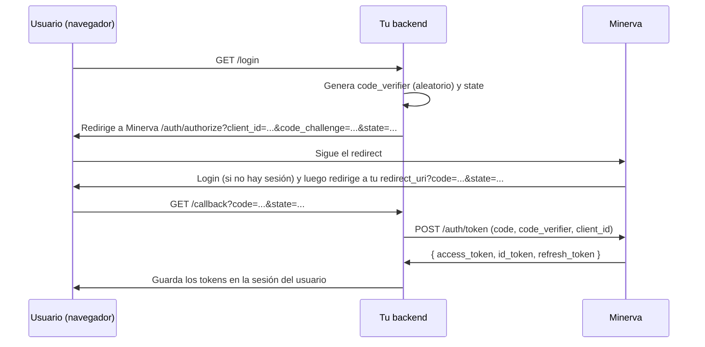

# Guía de integración: cómo conectar tu sistema a Minerva

Esta guía es para equipos que quieren delegar login y autorización a Minerva. Si algún
término no es familiar, revisa primero [`glosario.md`](glosario.md).

## Resumen del contrato

1. Registras tu aplicación en Minerva (`client_id`, redirect URI, cliente público o
   confidencial).
2. Declaras tus permisos y roles en un `manifest.minerva.yml`.
3. Tu frontend redirige el login a Minerva (`/auth/authorize`).
4. Tu backend canjea el código por tokens (`/auth/token`) y valida cada request con el
   SDK (`minerva_sdk`), que verifica la firma RS256 contra el JWKS de Minerva y consulta
   permisos en tiempo real — **nunca validas roles localmente**.

> **Requisito de acceso (importante):** el usuario debe tener **al menos un rol asignado
> en tu aplicación** para que Minerva emita el código de autorización. Si no lo tiene,
> Minerva **no** manda `code`: redirige a `redirect_uri?error=access_denied&state=...`.
> Tu `/callback` debe manejar ese caso (ver [§3.5](#35-acceso-denegado-usuario-sin-rol-en-tu-aplicación)).

## 1. Registrar tu aplicación

### Opción A: vía API (sesión de administrador)

```bash
curl -X POST http://localhost:9000/applications \
  -H "Authorization: Bearer <admin_token>" \
  -H "Content-Type: application/json" \
  -d '{"name": "Godín", "slug": "godin", "is_public": true}'
```

- `is_public: true` → cliente público (SPA/móvil sin backend que pueda guardar un
  secreto): la respuesta no incluye `client_secret_hash` y el canje de token exige PKCE.
- `is_public: false` (default) → cliente confidencial: Minerva genera y devuelve un
  `client_secret` (guárdalo de inmediato, no se vuelve a mostrar).

Registra la(s) redirect URI(s) exactas:

```bash
curl -X POST http://localhost:9000/applications/{application_id}/redirect-uris \
  -H "Authorization: Bearer <admin_token>" \
  -H "Content-Type: application/json" \
  -d '{"uri": "http://localhost:8100/callback", "environment": "development"}'
```

Minerva rechaza cualquier `redirect_uri` en `/auth/authorize` que no coincida
exactamente con una registrada (evita *open redirect*). Registra una entrada por
entorno (`development`, `production`).

### Opción B: vía manifiesto (recomendado si ya vas a declarar permisos)

Si subes un `manifest.minerva.yml` con `application.code` nuevo, Minerva crea la
aplicación automáticamente al importarlo (ver sección 2) y devuelve el `client_id`/
`client_secret` generados en la respuesta del import. Las redirect URIs declaradas en
`application.redirect_uris` también se registran.

## 2. Declarar permisos y roles (`manifest.minerva.yml`)

Convención de permisos: **`{application_code}.{resource}.{action}`**, con `action` una
de `view, create, update, delete, assign, approve, authorize, export, import, manage`.

```yaml
application:
  code: godin                          # slug único, minúsculas/números/guion_bajo
  name: Godín
  description: Gestor de oficios y solicitudes
  base_url: http://localhost:8000
  redirect_uris:
    - http://localhost:8000/auth/callback

permissions:
  - key: godin.oficios.view
    name: Ver oficios
    description: Permite consultar oficios
  - key: godin.oficios.create
    name: Crear oficios

roles:
  - name: Consulta
    description: Solo lectura
    permissions:
      - godin.oficios.view
  - name: Capturista
    permissions:
      - godin.oficios.view
      - godin.oficios.create
```

Validaciones que aplica Minerva al importar (`backend/app/modules/devkit/manifest.py`):
- `application.code` obligatorio, formato `^[a-z0-9_]+$`.
- Cada `permissions[].key` debe matchear `^[a-z0-9_]+\.[a-z0-9_]+\.[a-z0-9_]+$` **y**
  empezar con `{application.code}.` — no puedes declarar permisos de otra aplicación.
- Cada permiso listado en `roles[].permissions` debe existir en `permissions` del mismo
  manifiesto.

**Idempotencia:** reimportar el mismo manifiesto (o una versión actualizada) hace
*upsert* — actualiza nombres/descripciones, agrega permisos/roles nuevos, nunca borra ni
regenera secrets de una aplicación ya existente.

### Cómo importarlo

**Automático al arrancar Minerva (dev):** coloca el archivo en `manifests/` con alguno
de estos nombres/patrones: `*.minerva.yml`, `*.minerva.yaml`, `manifest.yml`,
`manifest.yaml`. Si `MINERVA_AUTO_IMPORT_MANIFESTS=true` (default en dev), se importa en
cada arranque del backend.

**Manual, vía API:**

```bash
curl -X POST http://localhost:9000/applications/import-manifest \
  -H "Authorization: Bearer <admin_token>" \
  -F "file=@manifest.minerva.yml"
```

> El import por API vive en el panel admin (`/applications/import-manifest`, requiere rol
> de administrador). El Dev Kit `/api/v1` es solo self-service (dev-login, `me`, `me/permissions`).

## 3. Flujo OIDC: Authorization Code + PKCE



### 3.1 Iniciar el login (tu frontend → Minerva)

```
GET {MINERVA_ISSUER}/auth/authorize
    ?client_id={tu client_id}
    &redirect_uri={tu redirect_uri registrada}
    &response_type=code
    &scope=openid profile email
    &state={valor aleatorio, verificas que vuelva igual}
    &code_challenge={BASE64URL(SHA256(code_verifier))}   # obligatorio si cliente público
    &code_challenge_method=S256
    &nonce={opcional, anti-replay del id_token}
```

Parámetros adicionales soportados (OIDC Core 3.1.2.1):
- `prompt=none` → si no hay sesión, Minerva responde `error=login_required` en lugar de
  mostrar login (útil para *silent renew* en iframes).
- `prompt=login` → fuerza re-autenticación aunque haya sesión (pide credenciales de nuevo).
- `prompt=select_account` → muestra un **selector de cuentas** con las sesiones ya iniciadas en
  ese navegador, permite elegir otra o **agregar una cuenta nueva**. Úsalo cuando tu plataforma
  cierre sesión y quieras que el usuario pueda entrar con una cuenta distinta (sin él, Minerva
  hace SSO silencioso con la última cuenta activa).
- `max_age={segundos}` → fuerza re-autenticación si la sesión es más vieja que ese valor.

> **Logout de Minerva.** `POST /auth/logout` (con el `access_token` en el header) revoca el token
> del lado del servidor: a partir de ese momento Minerva ya no lo acepta, así que un `/authorize`
> posterior no re-autentica en silencio con esa sesión. Es independiente del logout de tu propia app.

### 3.2 Canjear el código (tu backend → Minerva, servidor-a-servidor)

```bash
curl -X POST {MINERVA_ISSUER}/auth/token \
  -H "Content-Type: application/x-www-form-urlencoded" \
  -d "grant_type=authorization_code" \
  -d "client_id={tu client_id}" \
  -d "code={code recibido}" \
  -d "redirect_uri={misma redirect_uri}" \
  -d "code_verifier={el verifier original}" \
  -d "client_secret={solo si tu cliente es confidencial}"
```

Respuesta:

```json
{
  "access_token": "eyJhbGciOiJSUzI1NiIs...",
  "id_token": "eyJhbGciOiJSUzI1NiIs...",
  "refresh_token": "...",
  "token_type": "bearer",
  "expires_in": 900
}
```

### 3.3 Refrescar el access token

```bash
curl -X POST {MINERVA_ISSUER}/auth/token \
  -d "grant_type=refresh_token" \
  -d "client_id={tu client_id}" \
  -d "refresh_token={el refresh_token actual}"
```

El refresh token devuelto en la respuesta **reemplaza** al anterior (rotación): guarda
siempre el más reciente. Si reutilizas uno ya rotado, Minerva revoca toda la familia de
tokens — trátalo como de un solo uso.

> **Revocación server-side al cambiar credenciales.** Si el administrador cambia la
> contraseña o el correo del usuario, o lo desactiva, Minerva revoca de inmediato sus
> refresh tokens vigentes. El siguiente intento de refresh recibe **`400`** con
> `"refresh token ya utilizado; la sesión fue revocada por seguridad"` (mismo mensaje que
> la reutilización de un token ya rotado — la causa real es indistinguible desde el
> cliente); si además el usuario quedó inactivo, puede recibir **`403`**
> `"Usuario inválido o inactivo"`. En ambos casos, trátalo igual que un refresh expirado:
> manda al usuario de vuelta a `/login`. El `access_token` ya emitido **no** se invalida
> por firma (sigue siendo válido hasta su `exp`, ≤15 min) — la revocación solo se nota
> cuando tu backend vuelve a tocar a Minerva. `get_current_user` del SDK valida el JWT
> localmente (JWKS) y **no** se entera hasta que expira; `require_permission` sí consulta
> `GET /api/v1/me/permissions` en tiempo real (sujeto a su caché corta,
> `MINERVA_PERMISSIONS_CACHE_TTL`, desactivada por defecto) y por tanto responde `401` antes.

### 3.4 Cerrar sesión / revocar (RFC 7009)

```bash
curl -X POST {MINERVA_ISSUER}/auth/revoke \
  -d "client_id={tu client_id}" \
  -d "token={refresh_token a revocar}"
```

### 3.5 Acceso denegado: usuario sin rol en tu aplicación

Minerva solo emite el código si el usuario tiene **al menos un rol** en tu aplicación
(directo o por grupo). Si no lo tiene, en lugar de `code` responde con un error OAuth2
estándar (RFC 6749 §4.1.2.1) sobre tu `redirect_uri`:

```
{tu redirect_uri}?error=access_denied&state={el mismo state}
```

Esto **no requiere cambios en el SDK** (el SDK valida tokens ya emitidos; aquí todavía no
hay token). Se atiende en tu `/callback`: haz `code` opcional y maneja `error`.

```python
from fastapi.responses import RedirectResponse

@app.get("/callback")
async def callback(state: str, code: str | None = None, error: str | None = None):
    # Verifica siempre que `state` coincida con el que generaste en /login.
    if error:
        # error=access_denied → el usuario se autenticó pero no tiene rol en esta app.
        # Muéstrale una pantalla propia de "sin acceso", no intentes canjear el token.
        return RedirectResponse("/sin-acceso")
    if not code:
        return RedirectResponse("/sin-acceso")
    # ... flujo normal: canjear `code` en /auth/token (ver §3.2)
```

Para conceder acceso, un administrador de Minerva asigna al usuario un rol de tu
aplicación (panel admin o al crear el usuario). El rol global `minerva.admin` siempre
puede entrar. Otros valores de `error` posibles: `login_required` (con `prompt=none` sin
sesión) — trátalos igual, leyendo `error` en el callback.

### 3.6 Login en popup (opt-in, sin salir de tu pantalla)

Por defecto el login es un redirect full-page (§3.1): sacas al usuario a Minerva y
regresa a tu `redirect_uri`. Si prefieres **no sacarlo de tu UI**, puedes abrir el login
de Minerva en un popup. Es **opt-in por request**: agregas `response_mode=web_message` a
la URL de `/authorize`. En ese modo Minerva **no navega** la ventana al `redirect_uri`;
en su lugar devuelve el resultado al opener vía `window.postMessage` y cierra el popup.

- **No requiere cambios en el SDK ni configuración por app en Minerva.** El redirect
  full-page sigue siendo el comportamiento por defecto.
- El `postMessage` se envía con `targetOrigin = origen de tu redirect_uri` (nunca `"*"`).
  Como Minerva valida el `redirect_uri` contra su allowlist antes de emitir el `code`, el
  `code` solo puede llegar a un origen ya registrado como tuyo — esa es la frontera de
  confianza. Aun así, **valida `event.origin`** en tu listener.
- La URL a abrir es la del **panel web** de Minerva (donde vive la pantalla de login), que
  en desarrollo puede diferir del `issuer`/API (p. ej. `:3100` vs `:9000`). El canje del
  `code` sigue siendo server-to-server contra el `issuer` (§3.2).

```html
<script>
  // Solo aceptamos mensajes del origen del panel web de Minerva.
  const MINERVA_ORIGIN = new URL("https://minerva.example.gob.mx").origin;

  window.addEventListener("message", async (e) => {
    if (e.origin !== MINERVA_ORIGIN || e.data?.source !== "minerva") return;
    if (e.data.error) {
      // access_denied (sin rol) o login_required — muestra tu pantalla de "sin acceso".
      return;
    }
    // Recibiste el `code`; canjéalo en TU backend (server-to-server, con el code_verifier).
    await fetch("/popup/exchange", {
      method: "POST",
      headers: { "Content-Type": "application/json" },
      body: JSON.stringify({ code: e.data.code, state: e.data.state }),
    });
  });

  document.getElementById("login").onclick = () => {
    const authUrl =
      `${MINERVA_ORIGIN}/authorize?client_id=${CLIENT_ID}` +
      `&redirect_uri=${encodeURIComponent(REDIRECT_URI)}` +
      `&response_type=code&scope=openid%20profile%20email&state=${STATE}` +
      `&code_challenge=${CHALLENGE}&code_challenge_method=S256` +
      `&response_mode=web_message`; // <-- opt-in al modo popup
    window.open(authUrl, "minerva-login", "width=480,height=680");
  };
</script>
```

El mensaje que recibe el opener es `{ source: "minerva", code, state, error }`. El caso
denegado (§3.5) llega como `{ error: "access_denied" }` por el mismo canal. Ver
`examples/godin-consumer` (`/popup` y `/popup/exchange`) para un ejemplo completo.

## 4. Validar tokens y permisos con el SDK (`minerva_sdk`)

```bash
pip install -e path/to/minerva/sdk   # o como dependencia publicada, según tu setup
```

Variables de entorno del SDK (`minerva_sdk/config.py`):

| Variable | Para qué |
|---|---|
| `MINERVA_ISSUER_URL` | URL base de Minerva (de donde se descarga el JWKS) |
| `MINERVA_APPLICATION_CODE` | tu `application_code` — **obligatorio**: se exige siempre como `aud` y se usa para consultar `/me/permissions` |
| `MINERVA_EXPECTED_ISSUER` | issuer esperado del `iss`; si se deja vacío se usa `MINERVA_ISSUER_URL`. La validación de `iss` no se puede desactivar |
| `MINERVA_JWKS_CACHE_TTL` | segundos de caché del JWKS (default 3600) |
| `MINERVA_JWKS_REFRESH_COOLDOWN` | segundos mínimos entre refrescos del JWKS por `kid` desconocido (default 30) |
| `MINERVA_PERMISSIONS_CACHE_TTL` | segundos de caché de permisos (default **0 = sin caché**) |
| `MINERVA_REQUEST_TIMEOUT` | segundos de timeout de las llamadas a Minerva (default 10) |

> **El objeto de usuario son solo claims.** El dict que devuelven `get_current_user` y
> `require_permission` nunca contiene el bearer, así que es seguro serializarlo o
> registrarlo. Si vienes del SDK 0.1.0, ver «Migración desde 0.1.0» en `sdk/README.md`:
> `user["_token"]` ya no existe.

> **Revocación inmediata por defecto.** El SDK **no cachea permisos** salvo que lo actives:
> cada chequeo consulta a Minerva, que es quien aplica la revocación, así que revocar un
> token deja de autorizar en el acto. Si pones `MINERVA_PERMISSIONS_CACHE_TTL > 0` ganas
> menos tráfico a cambio de que una revocación tarde hasta ese TTL en notarse.

> **Rotación de claves.** Si Minerva rota su clave de firma, el SDK refresca el JWKS al ver
> un `kid` desconocido: la rotación **no** produce 401 espurios.

```python
from fastapi import Depends, FastAPI
from minerva_sdk.fastapi import get_current_user, require_permission

app = FastAPI()

@app.get("/whoami")
async def whoami(user: dict = Depends(get_current_user)):
    return {"sub": user["sub"], "email": user.get("email")}

@app.get("/oficios")
def crear_oficio(user: dict = Depends(require_permission("godin.oficios.create"))):
    ...
```

`require_permission` consulta `GET /api/v1/me/permissions?application={code}` en
Minerva (con el Bearer del usuario) en tiempo real, con una caché corta. Si Minerva
responde `401` (token revocado), el SDK propaga `401` a tu cliente; si el usuario no
tiene el permiso, responde `403`.

**Nunca** valides permisos comparando `roles` localmente — el contrato es: el SDK
pregunta a Minerva, Minerva decide.

## 5. Ejemplo de referencia completo

`examples/godin-consumer/` es un consumidor mínimo funcional: cliente público + PKCE,
`/login`, `/callback`, `/whoami` y `/protegido` (con `require_permission`), más `/popup`
y `/popup/exchange` que demuestran el login en popup de §3.6. Su `README.md` trae el flujo
de prueba manual paso a paso, incluyendo los `curl` exactos para registrar la aplicación y
probar el endpoint protegido.

## 6. Diferencias entre Dev y Producción al integrar

| Aspecto | Dev | Producción |
|---|---|---|
| `MINERVA_ISSUER_URL` (en tu sistema) | `http://localhost:9000` | URL pública de Minerva = el host de nginx **sin `:9000`** (todo va consolidado tras nginx); HTTPS al tener certificado |
| Verificación de `aud`/`iss` | siempre activa (`aud`=`application_code`, `iss`=`issuer_url`) | fija `MINERVA_EXPECTED_ISSUER` al issuer público si difiere del host de JWKS |
| Registro de `redirect_uri` | localhost, puertos de desarrollo | dominio real de tu sistema, HTTPS |
| Manifiesto | auto-importado al arrancar Minerva en local | importar explícitamente vía API/CI en el despliegue, no depender de auto-import |
| Secrets (`client_secret`) | puede vivir en `.env` local | secret manager — nunca en el repo ni en logs |

Ver [`despliegue.md`](despliegue.md) para cómo se endurece Minerva mismo en producción.

## 7. Branding de tu aplicación en el login (opcional)

Cuando un usuario entra a Minerva desde tu sistema, la pantalla de login puede mostrar el
nombre, logo y color de tu aplicación (estilo "Iniciar sesión en …") en lugar del branding
genérico de Minerva. **No requiere ningún cambio en tu sistema ni en el SDK**: es solo
configuración del lado de Minerva.

Campos (todos opcionales) en la aplicación:

| Campo | Uso en la pantalla de login |
|---|---|
| `display_name` | Nombre a mostrar. Si se omite, se usa `name`. |
| `logo_url` | URL del logo (imagen accesible públicamente). Si falla, cae al logo del IIEG. |
| `brand_color` | Color hex (p. ej. `#5C2472`). Colorea el botón de acceso. |

Se configuran desde el **panel admin** (editar aplicación → "Branding en el login"), o vía API:

```bash
curl -X PATCH {MINERVA_ISSUER}/applications/{application_id} \
  -H "Authorization: Bearer <admin_token>" \
  -H "Content-Type: application/json" \
  -d '{"display_name": "Godín Oficios", "logo_url": "https://.../logo.png", "brand_color": "#5C2472"}'
```

La pantalla de login descubre el branding por `client_id` a través de un endpoint público
de solo lectura (`GET /public/apps/{client_id}/branding`) que expone **únicamente** esos
datos no sensibles — nunca `client_secret` ni las redirect URIs. Si tu app no define
branding, el login usa la identidad genérica de Minerva.
